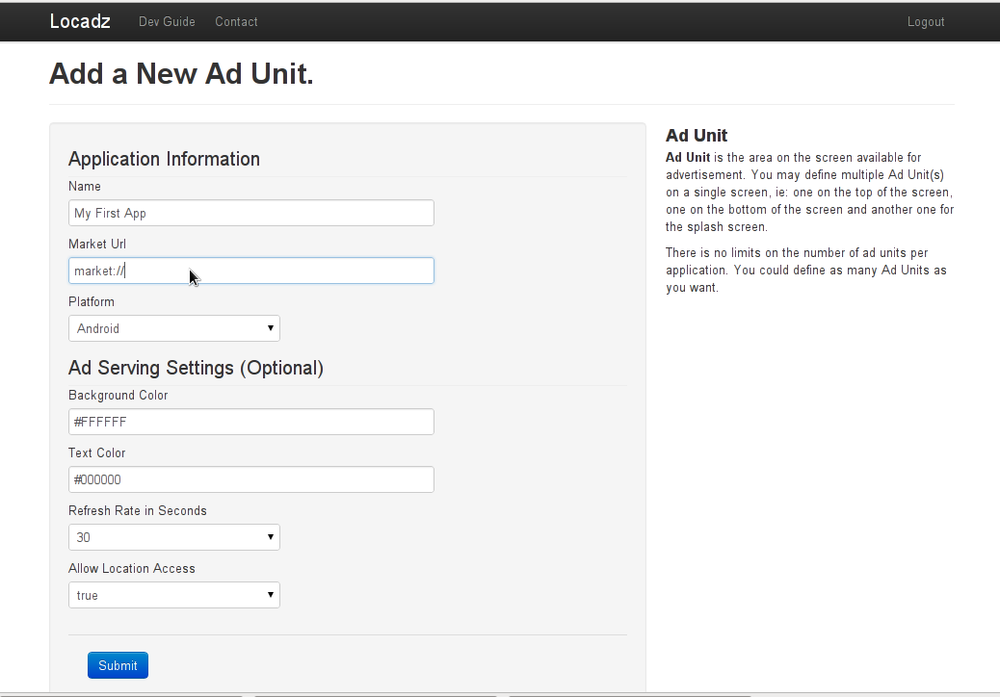
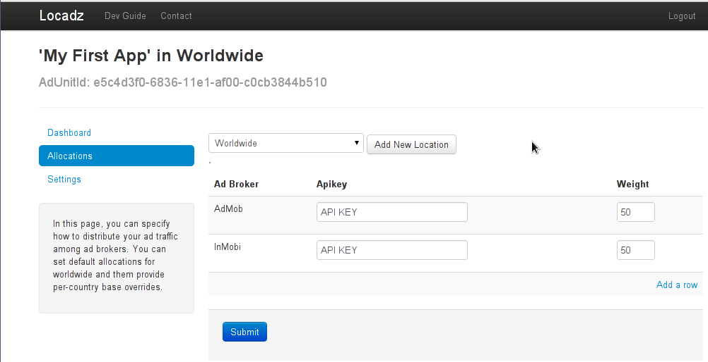

Locadz Android SDK Setup
========================

The Locadz Android SDK allows you to integrate the following mobile ad networks into your application
 - AdMob_
 - `Komli Mooile`_
 - millennialmedia_

.. _Komli Mooile: http://www.komlimobile.com/
.. _millennialmedia : http://mmedia.com/platform-sdk/android

This instruction assume that you have been familiar with Eclipse_, `Eclipse Android Development Tool`_, Maven_
and m2e-android_ (when using maven). Also,
you have had registered and obtained api key form the ad networks.

.. _Eclipse: http://www.eclipse.org/
.. _Eclipse Android Development Tool: http://developer.android.com/sdk/eclipse-adt.html
.. _AdMob: http://www.admob.com/
.. _Maven: http://maven.apahe.org/
.. _m2e-android: http://rgladwell.github.com/m2e-android/

1. Import SDK Library
---------------------

The Android SDK can be download from `GitHub download section`_ or from maven repository. The Locadz Android SDK
requires Jackson_ Json processor and we have pre-packaged it into our jar release.

If you would like to use Maven release, please include the following code in your pom.xml.

.. code-block:: xml

  <dependency>
     <groupId>com.locadz</groupId>
     <artifactId>android-sdk</artifactId>
     <version>1.0.0</version>
  </dependency>

Or you can refer to the android-sdk-example_ project to see how to use maven with android project.

.. _GitHub download section: https://github.com/locadz/android-sdk/downloads
.. _Jackson: http://jackson.codehaus.org/
.. _android-sdk-example: https://github.com/locadz/android-sdk-example

2. Import Ad Broker SDK Libraries
----------------------------------

Due to licensing issue, we cannot include any 3rd party AdBroker SDK library into our SDK.  You must download the 3rd
party Ad Broker SDK libraries and put it into your android project by yourself. Please contact your AdBroker to get
the SDK library.

3. Assign Traffic to Ad Brokers
--------------------------------

You have to have an account with Locadz first. If you don't have one, please sign-up one from `our website`_ It
only take few clicks to setup an account and it is ready for use immediately.

And then you have to create an new :ref:`Ad Unit`.

Then assign ad broker(s) to this :ref:`Ad Unit`

.. _our website: http://www.locadz.com

4. Permissions
--------------

The minimum required permissions for Locadz SDK is

.. code-block:: xml

    <uses-permission android:name="android.permission.INTERNET" />
    <uses-permission android:name="android.permission.ACCESS_NETWORK_STATE" />

Optionally, you can grant `android.permission.ACCESS_COARSE_LOCATION` to the SDK so that SDK would
be able to send user's location to the Locadz backend server. Otherwise, we will use the client ip's
location as user's current location.

.. code-block:: xml

    <uses-permission android:name="android.permission.ACCESS_COARSE_LOCATION" />

5. Setup AdUnitLayout
---------------------

To use the SDK, you must launch the `AdUnitAllocationService` in your AndroidManifest.xml.
The `AdUnitAllocationService` fetches, caches and reloads the ad traffic allocations for
AdUnitLayouts in your app.

.. code-block:: xml

    <service android:enabled="true" android:name="com.locadz.AdUnitAllocationService"/>

And then you have to add a new AdUntLayout to your Activity.

.. code-block:: xml

    <?xml version="1.0" encoding="utf-8"?>
    <LinearLayout
        xmlns:android="http://schemas.android.com/apk/res/android"
        xmlns:locadz="http://api.locadz.com/android/"

        android:orientation="vertical"
        android:layout_width="fill_parent"
        android:layout_height="fill_parent"
        android:id="@+id/layout_main" >
        <TextView
            android:layout_width="fill_parent"
            android:layout_height="wrap_content"
            android:text="@string/hello" />
        <com.locadz.AdUnitLayout
            android:id="@+id/adwhirl_layout"
            android:layout_width="fill_parent"
            android:layout_height="wrap_content"
            locadz:adunit_id="41a58fc0-6805-11e1-a0da-40407a4a486f"/>
    </LinearLayout>

5.1 Setup 3rd Party SDK
^^^^^^^^^^^^^^^^^^^^^^^

Some 3rd Party SDK may require additional configuration. Please refer to their SDK document for more
information.

